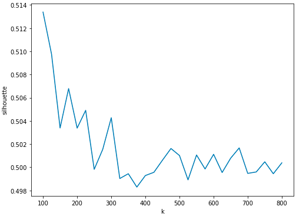
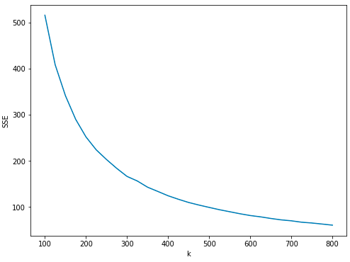
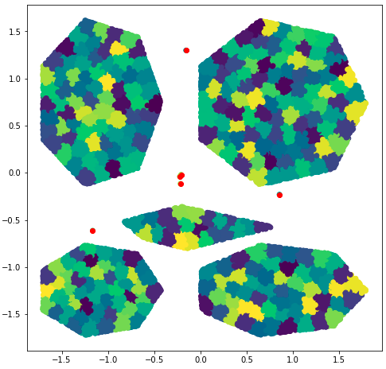

# OutlierDetection-using-Kmeans (Scala-Spark)

This project uses a K-Means model to detect outliers in data.
After cleaning and scaling the data set of 2D points, it creates clusters using a K-Means model with a large K.
For every point it calculates the euclidean distance of its center and according to a threshold it decides which point is an outlier.

According to the following plots, the value of K is set to 300.

Additionally with the threshold to be set to 0.2 the resaults are:

